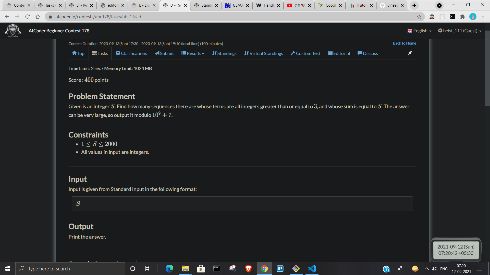
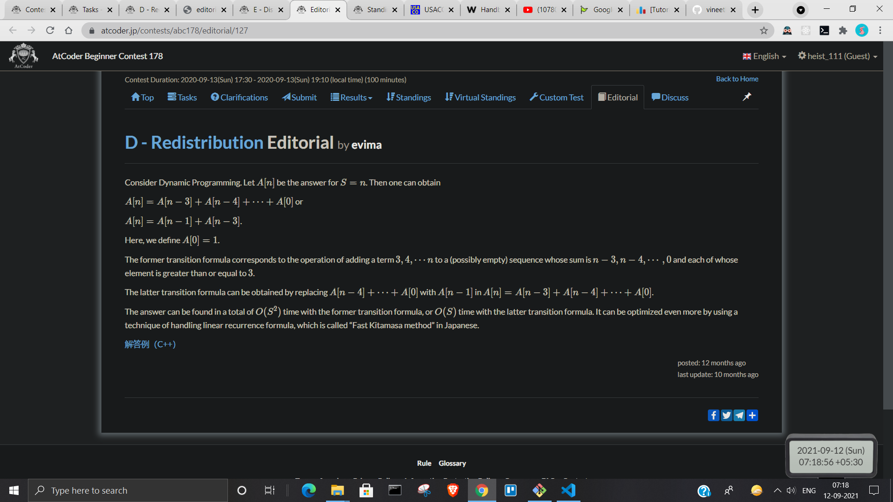
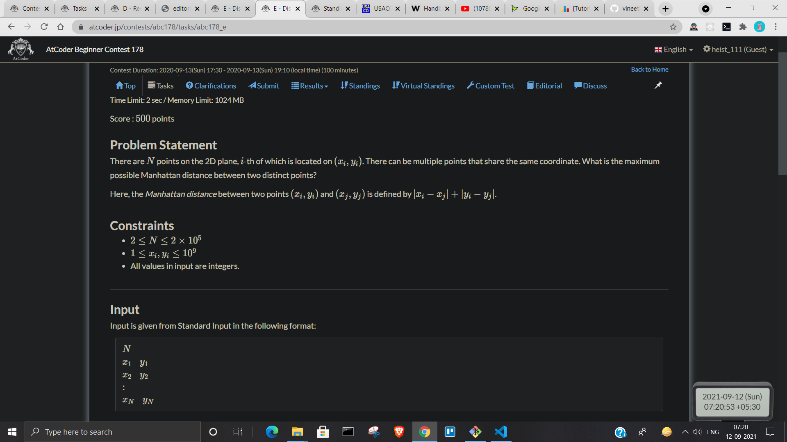
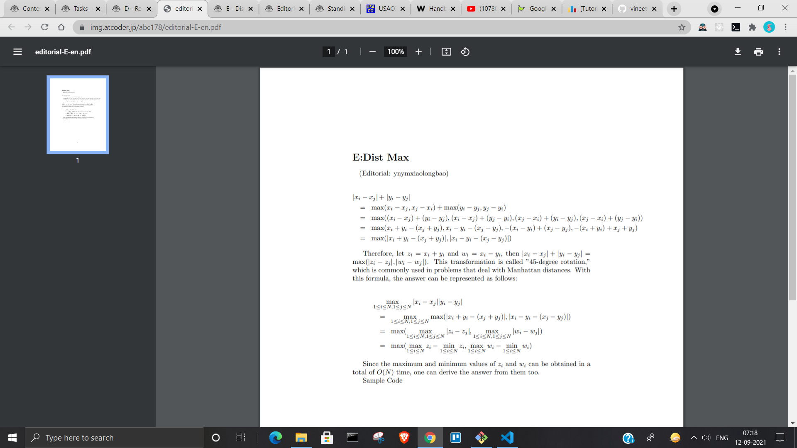

# Atcoder

## BContest 178

### Question D


Nice DP  


## Question E


new formula for calculating max. manhattan dist. between two points.  


## BContest 218

### Question C

[Question C](https://atcoder.jp/contests/abc218/tasks/abc218_c)

Code written:

```c++
#include<bits/stdc++.h>
#define int long long
using namespace std;
#define PII pair<int, int>
#define pub push_back
#define puf push_front
#define F first
#define S second
#define ld long double
#define fastIO ios::sync_with_stdio(0); cin.tie(0);
vector<int> dx = {-1, 1, 0, 0};
vector<int> dy = {0, 0, -1, 1};
const int inf = 0x3f3f3f3f;
int n, m;
// Fill these!
bool isValid(int i, int j) {return i>=0 && i<n && j>=0 && j<n;}
int modpow(int a, int b, int mod) {
    if(a == 0) return 0;
    else if(a == 1 || b == 0) return 1;
    int x = modpow(a, b/2, mod);
    if(b % 2 == 0) {
        x = (x*x)%mod;
    }else {
        x = (x*x)%mod;
        x = (x*a)%mod;
    }
    return x;
}
bool check_rotations(vector<string>& s, vector<string>& s1, vector<string>& s2, vector<string>& s3, vector<string>& t, int ii, int jj) {
    int n = s.size();
    int i1 = ii, j1 = jj;
    int check = true, res = false;;
    for(int i = 0; i<n; i++) {
        for(int j = 0; j<n; j++) {
            if(s[i1][j1] != t[i][j]) {check = false; break;}
            j1 = (j1 + 1)%n;
        }
        if(!check) break;
        i1 = (i1 + 1)%n;
    }

    res = res || check;
    check = true;
    i1 = ii, j1 = jj;

    for(int i = 0; i<n; i++) {
        for(int j = 0; j<n; j++) {
            if(s1[i1][j1] != t[i][j]) {check = false; break;}
            j1 = (j1 + 1)%n;
        }
        i1 = (i1 + 1)%n;
        if(!check) break;
    }

    res = res || check;
    check = true;
    i1 = ii, j1 = jj;

    for(int i = 0; i<n; i++) {
        for(int j = 0; j<n; j++) {
            if(s2[i1][j1] != t[i][j]) {check = false; break;}
            j1 = (j1 + 1)%n;
        }
        i1 = (i1 + 1)%n;
        if(!check) break;
    }

    res = res || check;
    check = true;
    i1 = ii, j1 = jj;

    for(int i = 0; i<n; i++) {
        for(int j = 0; j<n; j++) {
            if(s3[i1][j1] != t[i][j]) {check = false; break;}
            j1 = (j1 + 1)%n;
        }
        i1 = (i1 + 1)%n;
        if(!check) break;
    }

    res = res || check;
    return res;
}
int32_t main(){
    //fastIO
    /*freopen("input.txt", "r", stdin);
    freopen("output.txt", "w", stdout);*/
    int n; cin>>n;
    vector<string> s(n), t(n);
    for(int i = 0; i<n; i++) {cin>>s[i];}
    for(int i = 0; i<n; i++) {cin>>t[i];}

    vector<string> s1(n, string(n, ' ')), s2(n, string(n, ' ')), s3(n, string(n, ' '));

    for(int i = 0; i<n; i++) {
        for(int j = 0; j<n; j++) {
            s1[j][i] = s[i][j];
        }
    }

    for(int i = 0; i<n; i++) {
        for(int j = 0; j<n; j++) {
            int i1 = n-i - 1, j1 = n-j - 1;
            s2[i1][j1] = s[i][j];
        }
    }

    for(int i = 0; i<n; i++) {
        for(int j = 0; j<n; j++) {
            int i1 = n-i - 1, j1 = n-j - 1;
            s3[i1][j1] = s1[i][j];
        }
    }

    // for(int i = 0; i<n; i++) cerr<<s[i]<<"\n"; cerr<<"\n";
    // for(int i = 0; i<n; i++) cerr<<s1[i]<<"\n"; cerr<<"\n";
    // for(int i = 0; i<n; i++) cerr<<s2[i]<<"\n"; cerr<<"\n";
    // for(int i = 0; i<n; i++) cerr<<s3[i]<<"\n"; cerr<<"\n";

    for(int i = 0; i<n; i++) {
        for(int j = 0; j<n; j++) {
            if(check_rotations(s, s1, s2, s3, t, i, j)) {cout<<"Yes"<<"\n"; return 0;}
        }
    }

    cout<<"No"<<"\n";
    return 0;
}
```

Unable to find the reason for WA

## BContest 175

### Question D

[175_D](https://atcoder.jp/contests/abc175/tasks/abc175_d)

Editorial: [A submission](https://atcoder.jp/contests/abc175/submissions/15831678)

## BContest 174

### Question F

[174_F](https://atcoder.jp/contests/abc174/tasks/abc174_f)

Understood about Fenwick tree, but unable to answer the question.

## BConest M-SOLUTIONS Programming Contest 2020

### Questions E, F

[Que_E](https://atcoder.jp/contests/m-solutions2020/tasks/m_solutions2020_e)

[Que_F](https://atcoder.jp/contests/m-solutions2020/tasks/m_solutions2020_f)

Unable to get intuitions.
