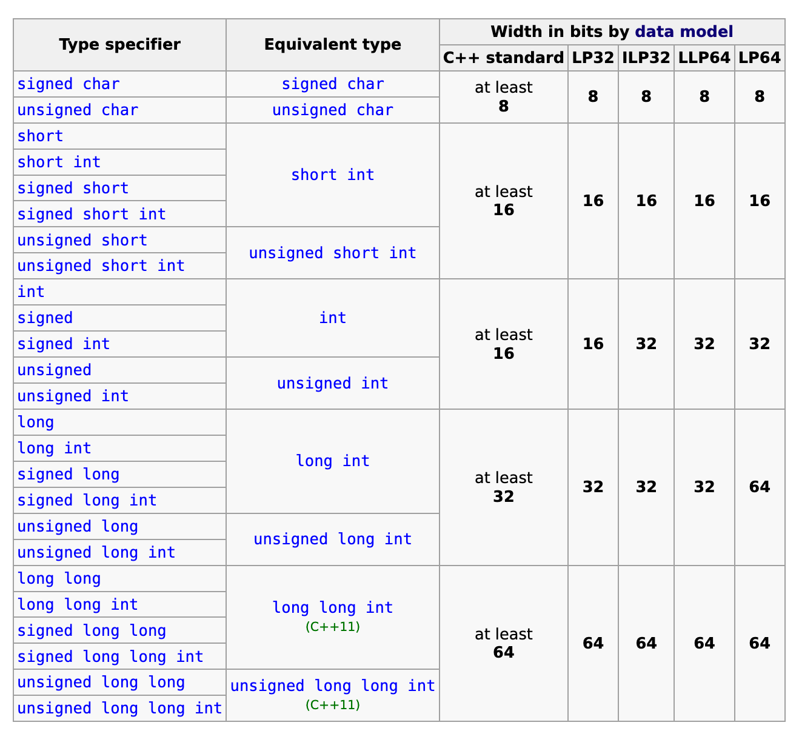

# C++

C++ is a general-purpose programming language created by Bjarne Stroustrup in 1979 at Bell Labs. It was designed as an extension of the C programming language, adding object-oriented features, stronger type checking, and other enhancements.

## History

- **1979**: Bjarne Stroustrup begins work on "C with Classes".
- **1983**: The language is renamed to C++.
- **1985**: The first edition of "The C++ Programming Language" is published.
- **1990s**: C++ becomes widely adopted, with the first ISO standard released in 1998 (C++98).
- **2011, 2014, 2017, 2020**: Major updates (C++11, C++14, C++17, C++20) introduce modern features like smart pointers, lambda expressions, concurrency support, and more.

## Key Features

- Object-oriented programming (classes, inheritance, polymorphism)
- Generic programming (templates)
- Low-level memory manipulation
- Strong performance and efficiency
- Extensive standard library

## Usage

C++ is used in system/software development, game engines, real-time simulations, embedded systems, and high-performance applications.

## Resources

- [C++ Reference](https://en.cppreference.com/)
- [ISO C++](https://isocpp.org/)
- "The C++ Programming Language" by Bjarne Stroustrup

## Fundamental Data 


## Standard Template Library (STL)

The Standard Template Library (STL) is a powerful set of C++ template classes that provide common data structures and algorithms. STL includes containers (like `vector`, `set`, `map`), iterators, algorithms (such as `sort`, `find`), and utility components.

### Uses in Competitive Programming

STL is widely used in competitive programming due to its efficiency, reliability, and ease of use. It allows programmers to quickly implement solutions using pre-built data structures and algorithms, reducing development time and minimizing bugs. Common STL containers like `vector`, `set`, `map`, and `priority_queue` are essential for handling typical problem constraints.

## Priority Queue

A `priority_queue` is an STL container adaptor that provides constant time access to the largest (by default) element. It is typically implemented as a max-heap. In competitive programming, `priority_queue` is useful for problems involving ordering, such as Dijkstra's shortest path algorithm, scheduling, and greedy strategies.

**Example:**

```cpp
#include <queue>
#include <vector>
#include <iostream>

int main() {
    std::priority_queue<int> pq;
    pq.push(5);
    pq.push(1);
    pq.push(10);

    while (!pq.empty()) {
        std::cout << pq.top() << " ";
        pq.pop();
    }
    // Output: 10 5 1
}
```

To create a min-heap, use:

```cpp
std::priority_queue<int, std::vector<int>, std::greater<int>> minHeap;
```